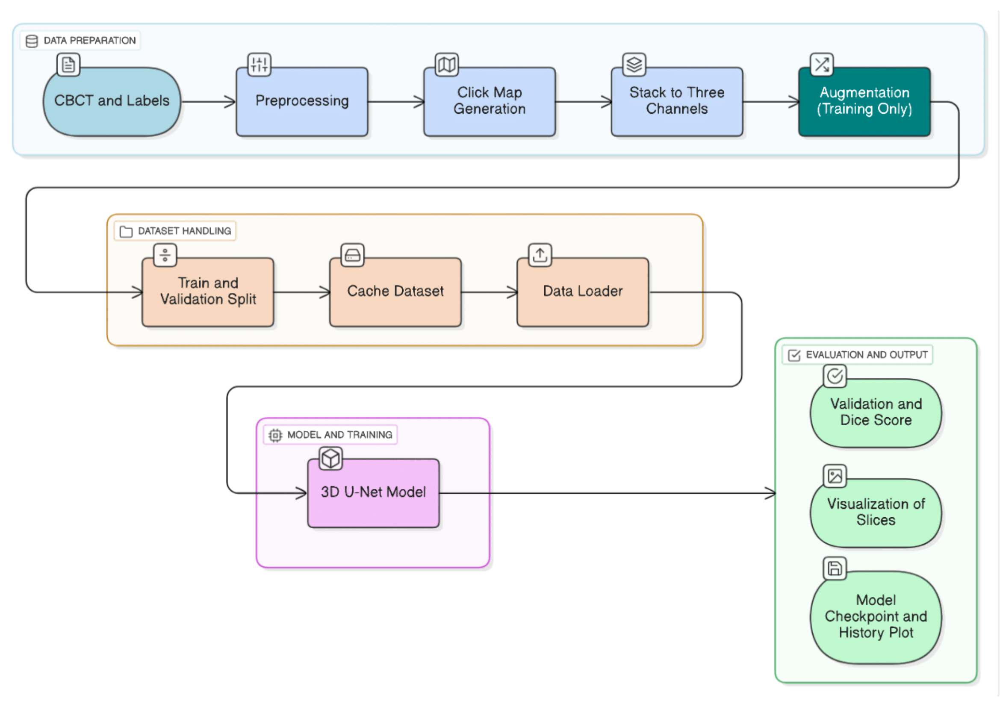
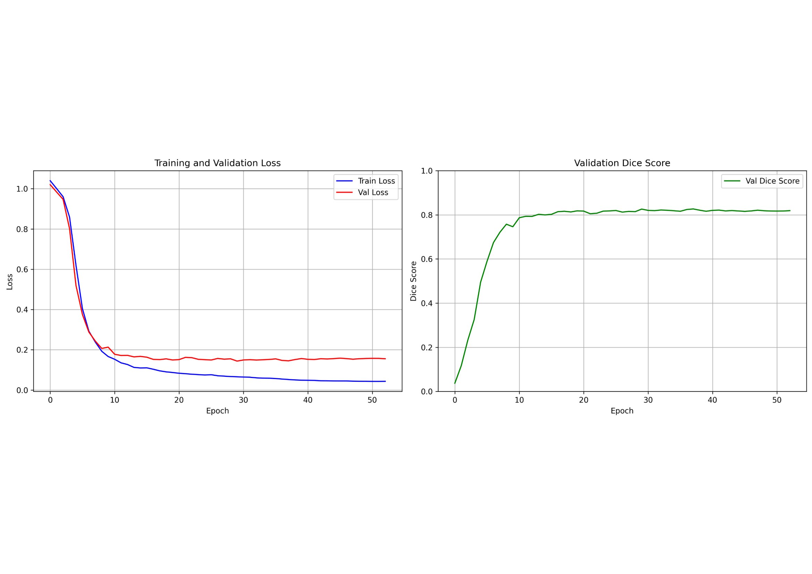

# High-Precision Automated Multi-Structure Segmentation in Dental CBCT

This repository contains the implementation of our hybrid, two-stage segmentation framework designed to achieve comprehensive multi-structure delineation in Dental CBCT. The pipeline unifies a robust automated stage (Task 1) with a focused interactive refinement stage (Task 2) to ensure sub-millimeter clinical accuracy for the Inferior Alveolar Canal (IAC).

## Task 1: Automated Multi-Structure Segmentation

_(Content to be added later)_

---

## Task 2: Focused Interactive Refinement (IAC)

### Method Summary

[cite_start]Our method employs a customized **3D U-Net with Interactive Click Guidance** to refine IAC segmentation, specifically addressing challenges in low-contrast regions or scans with metal artifacts.

The architecture and flow are designed as follows:

- **Architecture:** A customized 3D U-Net implemented in the MONAI framework, featuring four encoding/decoding stages with residual units and batch normalization.
- **Input Channels:** The network accepts a 3-channel input: the intensity-normalized CBCT volume, a left-canal click map, and a right-canal click map.
- **Interaction Simulation:** Click maps are generated by simulating user interactions along the canal centerline, smoothed using a Gaussian kernel to provide spatial guidance.
- **Refinement Goal:** This stage corrects segmentation failures from the automated phase, ensuring anatomically coherent predictions across all planes.

### Pipeline Overview



### Training Protocol

The model is trained using a hybrid loss (Dice loss + Focal loss) to mitigate class imbalance.

- **Patch Size:** 384x384x192.
- **Voxel Spacing:** Resampled to isotropic 0.3x0.3x0.3 mm.
- **Optimizer:** AdamW with weight decay (1e-5).
- **Scheduler:** ReduceLROnPlateau (factor=0.5, patience=5).
- **Batch Size:** 4.

The training process demonstrates stable convergence, reaching a validation Dice score of **0.86**.



---

## Environment Setup

### 1. Install Requirements

```bash
cd Task_2
pip install -r requirements.txt
```

### 2. Dataset


### 3. Automatic run:

```bash
cd Task_2
./run.sh
```

### 4. Manual run (if automatic fails):

Place the /images and /labels folders inside the /Task_2/input folder.

```bash
python3 train.py
```
Inference using the provided model

```bash
python3 inference.py
```


---

## Contact

For questions or clarifications, please contact drajo_george@DiceMed.in
